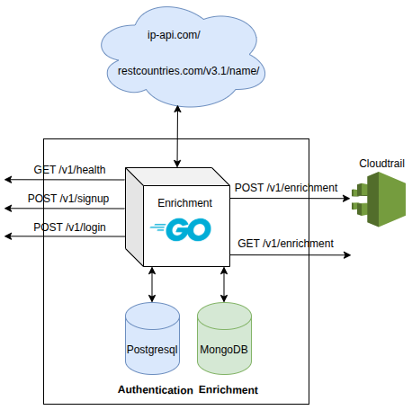

# cloudtrail-enrichment-api-golang

Security monitoring REST API that performs IP geolocation enrichment based on AWS CloudTrail logs.

<p align="center">
  
</p>


## Run application

    docker-compose down -v --rmi all
    docker-compose up --build -d

## API Endpoints


The available API endpoints are outlined below.
<br >

<details><summary><code> Health GET /v1/health   </code></summary>

## 

Health Endpoint (pingpong)


Request


```
curl -XGET 'localhost:9090/v1/health'
```

Success Response:

 - Status Code: 200

</summary></details>

-----------------------------------------------------------

<details><summary><code> Signup POST /v1/signup  </code></summary>

## 
This endpoint is used to register a new user using an email and password for authentication.


Request

Body:

```json
{
  "email": "usuario@example.com",
  "password": "123123123",
  "role": "user"
}
```

Success Response:

 - Status Code: 201

 - Body:

```json
{
  "error": false,
  "message": "1 registros procesados y enriquecidos exitosamente",
  "data": []
}
```


- Usage

```
    curl -X POST \
    -H "Content-Type: application/json" \
    -d '{
        "email": "usuario@example.com",
        "password": "123123123"
    }' \
    http://localhost:9090/v1/signup
```
</summary></details>

-----------------------------------------------------------

<details><summary><code> Login POST /v1/login  </code></summary>

## 
Authenticates a user by email and password, returning a JWT for accessing protected endpoints.


Request

Body:

```json
{
  "email": "usuario@example.com",
  "password": "123123123"
}
```

Success Response:

 - Status Code: 201

 - Body:

```json
{
  "error": false,
  "message": "Autenticación exitosa",
  "data": {
    "email": "usuario@example.com",
    "expiry": "2025-07-09T21:24:40.863560028Z",
    "token": "eyJhbGciOiJIUzI1NiIsInR5cCI6IkpXVCJ9...."
  }
}
```


- Usage

```
curl -X POST \
    -H "Content-Type: application/json" \
    -d '{
        "email": "usuario@example.com",
        "password": "123123123"
        }' \
    http://localhost:9090/v1/login
```
</summary></details>

-----------------------------------------------------------
<details><summary><code> Log ingestion POST /v1/enrichment  </code></summary>

## 
This endpoint is used for ingesting logs from CloudTrail for geolocation enrichment based on event IP addresses.


Request

Body:

```json
{
    "Records":[
        {
            "eventVersion":"1.0",
            "userIdentity":{
                "type":"IAMUser",
                "principalId":"EX_PRINCIPAL_ID",
                "arn":"arn:aws:iam::123456789012:user/Alice",
                "accessKeyId":"EXAMPLE_KEY_ID",
                "accountId":"123456789012",
                "userName":"Alice"
            },
            "eventTime":"2014-03-06T21:22:54Z",
            "eventSource":"ec2.amazonaws.com",
            "eventName":"StartInstances",
            "awsRegion":"us-east-2",
            "sourceIPAddress":"205.251.233.176",
            "userAgent":"ec2-api-tools 1.6.12.2",
            "requestParameters":{
                "instancesSet":{
                "items":[
                    {
                        "instanceId":"i-ebeaf9e2"
                    }
                ]
                }
            },
            "responseElements":{
                "instancesSet":{
                "items":[
                    {
                        "instanceId":"i-ebeaf9e2",
                        "currentState":{
                            "code":0,
                            "name":"pending"
                        },
                        "previousState":{
                            "code":80,
                            "name":"stopped"
                        }
                    }
                ]
                }
            }
        }
    ]
    }
```

Success Response:

 - Status Code: 201

 - Body:

```json
{
  "error": false,
  "message": "1 registros procesados y enriquecidos exitosamente",
  "data": []
}
```


- Usage

```
curl -X POST \
    -H "Content-Type: application/json" \
    -d @cloudtrail_sample.json \
    -w "%{http_code}\n" \
    http://localhost:9090/v1/enrichment | jq

```
</summary></details>

-----------------------------------------------------------

<details><summary><code> Retrieve last 10 records GET /v1/enrichment </code></summary>

## 
This endpoint is used to retrieve the last 10 enriched CloudTrail events stored in the database.

Request

```
/v1/enrichment
```

Success Response:

 - Status Code: 200


- Usage

```
    curl http://localhost:9090/v1/enrichment
    curl http://localhost:9090/v1/enrichment | jq '.data.events | length'
```
</summary></details>

-----------------------------------------------------------

## Database Querys

        db.enriched_events.find()
        
        db.enriched_events.find(
        { "sourceIPAddress": "205.251.233.176" },
        { "enrichment": 1, "_id": 0 }
        )


## Security by Design (Secure Design Principles)

- TM
- Auditory fields
- Token Design:
- Config (scaffold_config) ✅ Es ideal cuando no estás corriendo dentro de Docker. [Componente config para propagar las variables]
- .env para Docker y produccion

Parametros en texto plano, es mejor estandarizar y elegir uno.
- Podria servir para emular un test unitario del componente config.
- Redundante (escoger uno) config.go se presta para los dos.


UUID public API (mas seguro)
Si tienes una arquitectura monolítica y no estás preocupado por seguridad a ese nivel.
Pensar que siempre sera publica
Token con id

## Secure Deployment Practices 

- docker-compose.yml remove environment variables (.env it's not neccesary)
- Container security (Bitnami images, )
- Kubernetes security (Security context, )


HAY UN ARCHIVO DE COPIA VALIDAR EL FALLO EN LAS FIRMAS DEL SERVICIO !!!!!

makefile

BACKUP en bash

lea en el folder ultima version
rm -rf db-data
zip 


> Disclaimer

Aunque pueda parecer un antipatron, no lo es en este contexto. Hay una separación clara de responsabilidades en la persistencia de datos, sin embargo existen algunos riesgos. Hay una clara separación de responsabilidades. Aprovechar las ventajas de mongo para logs de cloudtrail.

No es un  antipattern. Una separación clara de responsabilidades en la persistencia de datos, lo cual es una buena práctica de diseño. Se  aprovechan las fortalezas de PostgreSQL para datos relacionales y de MongoDB para datos de documentos.

- Commando para obtener listado de vscode abierto y generar una nueva copia
- discriminar por tesis y relacionados cursos portfolio


